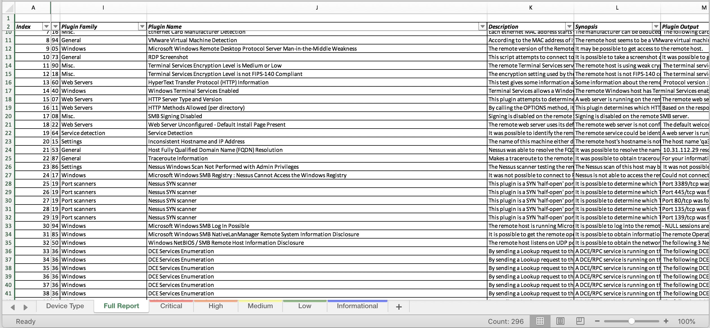

# NessusParser

Python based nessus parser that converts NessusV2 files into formatted XLSX documents.

# Key Features!

  - Multiple file support
  - Formatted XLSX output with worksheets (Full Detail, Device Type, Critical, High, Medium, Low, Informational)

## Table of Contents

  - [Inspiration](#inspiration)
  - [Planned Updates](#planned-updates)
  - [Screen](#screen)
  - [Pro's vs Con's](#pro's-vs-con's)
  - [Usage](#usage)
  - [Example](#example)


### Inspiration

Inspiration of this came from [Nessus Parser - Cody](http://www.melcara.com/archives/253). While this ruby one is still kicking, I prefer python. I hope to eventually emulate all of the features provide by this tool + more


#### Planned Updates

 - Charts: Total Vulnerabilities by Severity, Oldest by patch publication date, Top Offenders
 - Ignored Plugin ID's : Ignore ID's that are noisy, pointless, or other reasons
 - And more!

#### Screen

| Full Report |
| ---------------|
|  |


### Pro's vs Con's
#### Pro's
  - Fast
  - Multi file support
  - Nicely formatted
  - Commented Code (In Progress)

#### Con's
  - Error Checking? What's that! (I have yet to finish this code and wrote it quickly. Didn't implement much of any of this)
  - Memory usage (My MBP (16GB) handles 2GB worth of Nessus files without hiccup)
 

### Usage

```
pip install pipenv

pipenv install
pipenv shell

python nessusparser.py -l FOLDER_WITH_FILES -o OUTPUT_DIRECTORY/FILENAME
```

#### Example

```
Notice: No file extension specified

python nessusparser.py -l nessus_files -o reports/combined_report
```


